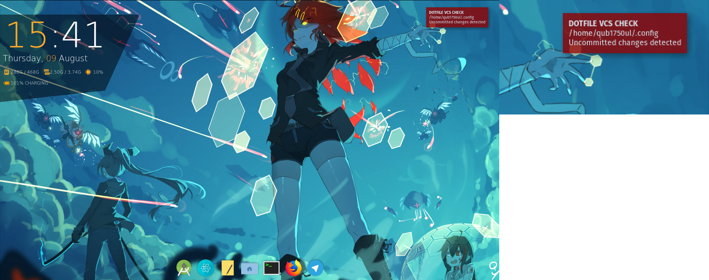
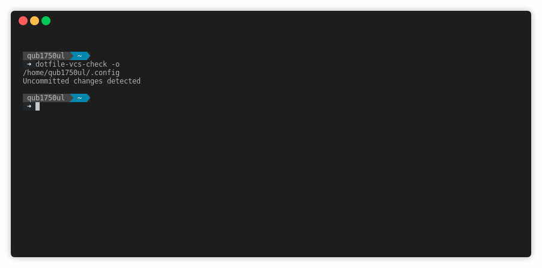

# dotfile-vcs-check #


  
[](http://keepachangelog.com)
[](http://semver.org)

A script that checks for changes in a dotfile git repository and notifies the user if there are any

## Table of contents ##

- [Usage](#usage)
- [Configuration](#configuration)
- [Dependencies](#dependencies)
- [Prepackaged releases](#prepackaged-releases)
- [Build & install instructions](#build--install-instructions)
- [Screenshots](#screenshots)
- [About the author & license info](#about-the-author--license-info)

## Usage ##

~~~sh
Usage: /usr/bin/dotfile-vcs-check [-o|--(no-)stdout] [-f|--config <arg>] [-h|--help] [<repo-1>] ... [<repo-n>] ...
	<repo>: path of a repository to check
	-o, --stdout, --no-stdout: redirect messages to standard output  (off by default)
	-f, --config: specifies a file containing a list of repositories to check  (no default)
	-h, --help: Prints help
~~~

Anyway, always refer to ```dotfile-vcs-check --help``` for the updated usage instructions

**NOTE to systemd users:**

The script is bundled with a systemd user timer unit that runs the script every 30 minutes to check the repositories listed in the user configuration file.  
This is active by default, you can either change this behavior editing the ```dotfile-vcs-check``` unit or disable it at all issuing ```systemctl --user disable dotfile-vcs-check.timer```

## Configuration ##

To work the script needs a list of repositories to check.  
The script tries to load it from several locations, in order of precedence:

- positonal arguments
- the file specified as argument of the ```-f | --config``` option
- ```${XDG_CONFIG_HOME}/dotfile-vcs-check/repolist```
- ```${HOME}/.config/dotfile-vcs-check/repolist```

## Dependencies ##
- ### Runtime ###

	- [bash](https://www.gnu.org/software/bash/) >= 3.0.0
	- [git](https://git-scm.com/)
	- [libnotify](https://github.com/GNOME/libnotify)
	- A notification server
		( [Here is a list](https://wiki.archlinux.org/index.php/Desktop_notifications#Notification_servers) )
	- (optional) [systemd](https://freedesktop.org/wiki/Software/systemd/) : scheduled checks via systemd timers

- ### Build ###

	- [Argbash](https://github.com/matejak/argbash)
	- [GNU coreutils](https://www.gnu.org/software/coreutils/coreutils.html)

## Prepackaged releases ##

- [ArchLinux PKGBUILD](https://github.com/qub1750ul/aur/tree/master/dotfile-vcs-check-git/PKGBUILD)


## Build & install instructions ##

Just ```cd``` to the repository root directory and run ```sudo ./install.sh /```

## Screenshots ##



Example of dotfile-vcs-check in action with [dunst](https://dunst-project.org/)



Example of dotfile-vcs-check in action in text mode

## About the author & license info ##

<a rel="license" href="http://creativecommons.org/licenses/by-sa/4.0/">

</a>
<br />
The
<span xmlns:dct="http://purl.org/dc/terms/" property="dct:title">dotfile-vcs-check</span> repository contents
by <a xmlns:cc="http://creativecommons.org/ns#" href="https://github.com/qub1750ul" property="cc:attributionName" rel="cc:attributionURL">Giuseppe Masino (qub1750ul)</a>
are licensed under a <a rel="license" href="http://creativecommons.org/licenses/by-sa/4.0/">Creative Commons Attribution-ShareAlike 4.0 International License</a>

If you need permissions that are beyond the scope of this license, you can ask me through this contacts,
in order of preference:  

- <a xmlns:cc="http://creativecommons.org/ns#" href="https://telegram.me/qub1750ul" rel="cc:morePermissions">Telegram</a>
- <a xmlns:cc="http://creativecommons.org/ns#" href="https://twitter.com/qub1750ul" rel="cc:morePermissions">Twitter</a>
- <a xmlns:cc="http://creativecommons.org/ns#" href="https://facebook.com/dev.giuseppemasino/" rel="cc:morePermissions">Facebook page</a>

The license text can be found in the LICENSE.md file
